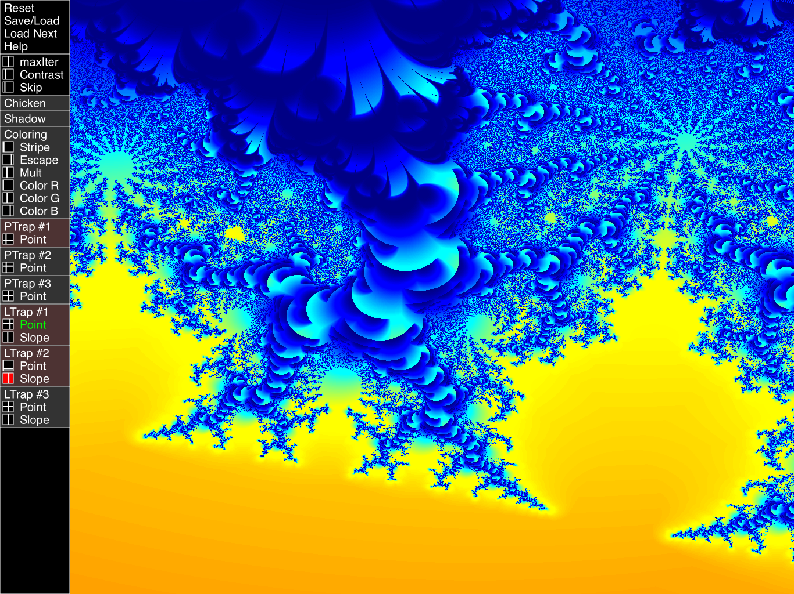

# BurningChicken2
Mandelbrot for iPad uses Swift and Metal

Simple Mandelbrot viewer altered slightly to produce the famous Burning Chicken.

Visit: https://fractalforums.org/fractal-mathematics-and-new-theories/28/triangle-inequality-average-algorithm/1368

User 3DickUlus posted a beautiful image with the fragment shader attached.\
I copied the algorithm onto this app to do some experimentation.

The original BurningChicken app produces beautiful Mandelbor images.\
This is the same engine with a whole new UX design.

It is very easy and efficient to develop with, \
and makes good use of little space on the screen. \
Hope you like it!

Added the Foam fractal algorithm, which has a beauty of its own.. \
visit: https://fractalforums.org/programming/11/mandelbrot-foam/2360

---------------------------------------\
So much to learn!\
Please visit: http://www.iquilezles.org/www/articles/ftrapsgeometric/ftrapsgeometric.htm \
to read about Point and Line Orbit Traps.

I added three Point and Line Orbit Traps to the Control Panel. \
It's a great effect!

